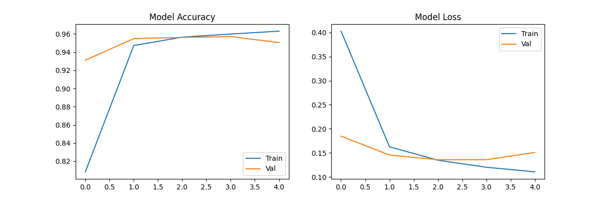

# Malaria Cell Detection using Deep Learning (CNN)

## 📌 Project Overview
Malaria is a life-threatening disease caused by parasites transmitted to people through the bites of infected female Anopheles mosquitoes. This project utilizes Deep Learning and Computer Vision to automate the detection of malaria-infected cells in microscopic blood smears.

Using a Custom Convolutional Neural Network (CNN) trained on the **NIH Malaria Dataset**, this model achieves **95.05% accuracy** in distinguishing between Parasitized and Uninfected cells.

## 📊 Dataset
* **Source:** National Institutes of Health (NIH) / TensorFlow Datasets
* **Size:** 27,558 Cell Images
* **Classes:**
    * `Parasitized`: Cells containing the Plasmodium parasite.
    * `Uninfected`: Healthy blood cells.

## 🧠 Model Architecture
The model is a Sequential CNN built with TensorFlow/Keras:
1.  **Input Layer:** Resized to 100x100x3 (RGB)
2.  **Convolutional Blocks:** Three blocks of Conv2D + MaxPooling to extract features (edges, textures, parasite shapes).
3.  **Dense Layers:** Fully connected layers with Dropout (0.5) to prevent overfitting.
4.  **Output Layer:** Sigmoid activation for binary classification.

## 📈 Results
* **Final Test Accuracy:** 95.05%
* **Loss:** 0.1509


*The training graph demonstrates steady convergence with minimal overfitting due to the use of Dropout and Data Augmentation.*

## 🛠️ Tech Stack
* **Language:** Python
* **Frameworks:** TensorFlow 2.x, Keras
* **Data Handling:** TensorFlow Datasets (TFDS), NumPy
* **Visualization:** Matplotlib

## 🚀 How to Run
1.  Clone the repository:
    ```bash
    git clone [https://github.com/YOUR_USERNAME/Malaria-Cell-Detection-CNN.git](https://github.com/YOUR_USERNAME/Malaria-Cell-Detection-CNN.git)
    ```
2.  Install dependencies:
    ```bash
    pip install tensorflow tensorflow-datasets matplotlib
    ```
3.  Run the training script:
    ```bash
    python main.py
    ```
